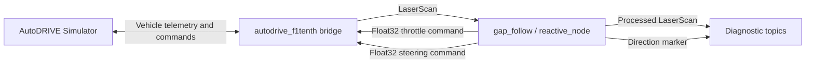

# Tutorial 4: F1TENTH Reactive Navigation with Follow the Gap in AutoDRIVE

## Project Description

This laboratory implements a basic reactive autonomous navigation controller for an F1TENTH vehicle using **ROS 2 Humble** and the **AutoDRIVE digital twin**.

The controller uses the **Follow the Gap (FTG)** method. Instead of generating a global route or using a previously built map, the vehicle reacts directly to the current LiDAR scan:

1. Keep the frontal region of the LiDAR.
2. Remove invalid measurements.
3. Find the closest obstacle.
4. Create a safety bubble around that obstacle.
5. Find the largest contiguous free-space gap.
6. Steer toward the center of the selected gap.
7. Adjust the throttle according to the steering angle.

## Laboratory Material

- **Slides:** [Tutorial 4 presentation](PASTE_PPT_LINK_HERE)

## Learning Objectives

After completing this laboratory, students should be able to:

- Identify the main stages of a reactive LiDAR-based controller.
- Understand how a `sensor_msgs/msg/LaserScan` message is processed.
- Explain the purpose of a safety bubble.
- Detect the largest valid free-space gap.
- Convert a target LiDAR index into a steering command.
- Compile and execute a C++ ROS 2 node with `ament_cmake`.

# 1. Prerequisites

This tutorial assumes that the AutoDRIVE simulator and its ROS 2 bridge were configured in the previous laboratories.

Required software:

- Ubuntu 22.04.
- ROS 2 Humble.
- AutoDRIVE Simulator with the F1TENTH vehicle.
- AutoDRIVE ROS 2 bridge package: `autodrive_f1tenth`.
- Git.
- Python 3.10 and `venv`.
- `rosdep`.
- `colcon`.
- A C++ compiler compatible with ROS 2 Humble.

Install the base system tools:

```bash
sudo apt update

sudo apt install -y \
  git \
  build-essential \
  cmake \
  python3-pip \
  python3-venv \
  python3-rosdep
```

Source ROS 2:

```bash
source /opt/ros/humble/setup.bash
```

Initialize `rosdep` only if it has not been initialized previously:

```bash
sudo rosdep init
rosdep update
```

If `rosdep` reports that it was already initialized, continue with the next step.

# 2. Activate the Existing Workspace and Virtual Environment

This tutorial continues the previous AutoDRIVE laboratories. Therefore, the following workspace and virtual environment are assumed to already exist:

```text
~/autodrive_ws
~/autodrive_ws/venv
```

Load ROS 2 and activate the existing project environment:

```bash
cd ~/autodrive_ws

source /opt/ros/humble/setup.bash
source ~/autodrive_ws/venv/bin/activate
```

Prevent `colcon` from scanning the internal folders of the virtual environment:

```bash
touch ~/autodrive_ws/venv/COLCON_IGNORE
```

Install or update the Python tools required by the bridge and the workspace:

```bash
python -m pip install --upgrade pip setuptools wheel

python -m pip install \
  colcon-common-extensions \
  gevent
```

Verify the active environment:

```bash
which python
which colcon

python -c "import colcon_core; print('colcon_core OK')"
python -c "from gevent import pywsgi; print('gevent OK')"
```

Expected paths:

```text
/home/<user>/autodrive_ws/venv/bin/python
/home/<user>/autodrive_ws/venv/bin/colcon
```

> The virtual environment isolates the Python dependencies used by this project. The C++ compiler and the ROS 2 Humble libraries continue to come from the system installation.

# 3. Download Only the Follow the Gap Project

The course repository contains tutorials and additional projects, but this laboratory only requires:

```text
f1tenth-gap-follow-autodrive/
```

Git does not provide a normal `git clone` command for a single subdirectory. The following procedure uses a temporary **non-cone sparse checkout**, extracts only the required folder, and then removes the temporary repository.

> Run this procedure only if `~/autodrive_ws/src/f1tenth-gap-follow-autodrive` does not already exist.

```bash
cd ~/autodrive_ws/src

git clone \
  --depth 1 \
  --filter=blob:none \
  --no-checkout \
  https://github.com/nabihandres/AUTODRIVE.git \
  .autodrive_sparse

cd .autodrive_sparse

git sparse-checkout init --no-cone
git sparse-checkout set '/f1tenth-gap-follow-autodrive/**'
git checkout main

cd ~/autodrive_ws/src

mv \
  .autodrive_sparse/f1tenth-gap-follow-autodrive \
  ./f1tenth-gap-follow-autodrive

rm -rf .autodrive_sparse
```

Only the required project should remain inside the workspace source directory:

```bash
find \
  ~/autodrive_ws/src/f1tenth-gap-follow-autodrive \
  -maxdepth 3 \
  -type f \
  | sort
```

Expected structure:

```text
~/autodrive_ws/src/
└── f1tenth-gap-follow-autodrive/
    └── gap_follow/
        ├── CMakeLists.txt
        ├── package.xml
        └── src/
            └── reactive_node.cpp
```

The root-level Markdown tutorials and the other repository folders are not copied into the workspace.

https://github.com/user-attachments/assets/3c75ff3b-b1c9-44ef-b199-9ab45c12937d

# 4. Install ROS 2 Dependencies

Return to the workspace root:

```bash
cd ~/autodrive_ws
```

Load ROS 2 and activate the virtual environment:

```bash
source /opt/ros/humble/setup.bash
source ~/autodrive_ws/venv/bin/activate
```

Install the dependencies declared in every `package.xml` file:

```bash
rosdep install \
  --from-paths src \
  --ignore-src \
  -r \
  -y
```

The `gap_follow` package uses ROS 2 interfaces such as:

- `rclcpp`
- `sensor_msgs`
- `std_msgs`
- `visualization_msgs`

The exact dependency list is declared in:

```text
gap_follow/package.xml
```

# 5. Build the ROS 2 Packages

The Follow the Gap node is written in C++, so it is compiled using:

```text
CMakeLists.txt
```

Clean only the package if it was compiled previously with another structure:

```bash
cd ~/autodrive_ws

rm -rf build/gap_follow
rm -rf install/gap_follow
```

Confirm that `colcon` detects the package:

```bash
colcon list | grep gap_follow
```

Build the bridge and the Follow the Gap package:

```bash
colcon build \
  --packages-select autodrive_f1tenth gap_follow \
  --symlink-install
```

If the bridge was already compiled and has not changed, build only the controller:

```bash
colcon build \
  --packages-select gap_follow \
  --symlink-install
```

Load the workspace:

```bash
source ~/autodrive_ws/install/setup.bash
```

Verify that ROS 2 can find the C++ executable:

```bash
ros2 pkg executables gap_follow
```

Expected result:

```text
gap_follow reactive_node
```

The installed C++ executable should also exist at:

```bash
file ~/autodrive_ws/install/gap_follow/lib/gap_follow/reactive_node
```

It should be reported as an ELF executable.

https://github.com/user-attachments/assets/3a91f300-3dce-4cb5-96a2-df3e4c50b28b

# 6. ROS 2 System Overview



Main components:

1. **AutoDRIVE Simulator**  
   Simulates the F1TENTH vehicle, LiDAR, actuators, and environment.

2. **AutoDRIVE ROS 2 Bridge**  
   Exchanges telemetry and actuator commands between Unity and ROS 2.

3. **Reactive Follow the Gap Node**  
   Processes the LiDAR scan and publishes throttle and steering commands.


# 7. Topics Used by the Controller

## Subscription

The node receives the F1TENTH LiDAR scan from:

```text
/autodrive/f1tenth_1/lidar
```

Message type:

```text
sensor_msgs/msg/LaserScan
```

## Control Publishers

Steering command:

```text
/autodrive/f1tenth_1/steering_command
```

Throttle command:

```text
/autodrive/f1tenth_1/throttle_command
```

Both commands use:

```text
std_msgs/msg/Float32
```

## Diagnostic Publishers

Processed LiDAR scan:

```text
/processed_scan
```

Selected direction marker:

```text
/visualization_marker
```

# 8. Project Execution

## 8.1 Start the AutoDRIVE Simulator

Open a terminal in the directory that contains the simulator executable and run:

```bash
./"AutoDRIVE Simulator.x86_64"
```

Load the F1TENTH environment used for the laboratory and keep the simulator running before starting the ROS 2 controller.

Inside the simulator:

1. Activate the communication bridge.
2. Wait until its status displays `Connected`.
3. Set the vehicle control mode to `Autonomous`.

## 8.2 Terminal 1 — Start the AutoDRIVE Bridge

```bash
cd ~/autodrive_ws

source /opt/ros/humble/setup.bash
source ~/autodrive_ws/venv/bin/activate
source ~/autodrive_ws/install/setup.bash

ros2 launch autodrive_f1tenth simulator_bringup_headless.launch.py
```

This launch file starts:

- The incoming AutoDRIVE bridge.
- The outgoing AutoDRIVE bridge.

## 8.3 Terminal 2 — Start Follow the Gap

Open a second terminal:

```bash
cd ~/autodrive_ws

source /opt/ros/humble/setup.bash
source ~/autodrive_ws/venv/bin/activate
source ~/autodrive_ws/install/setup.bash

ros2 run gap_follow reactive_node
```

The vehicle should begin reacting to the LiDAR measurements and moving toward the largest valid free-space region.

https://github.com/user-attachments/assets/a04481bb-35de-40f7-a2c8-5bb5c07f9218

# 9. Basic Follow the Gap Method

Follow the Gap is a **reactive local navigation method**. It does not calculate a complete trajectory from a starting point to a global destination.

At every LiDAR callback, the controller answers a simpler question:

> Which direction currently provides the largest safe opening in front of the vehicle?

The basic design process is:

```text
LiDAR scan
    ↓
Select frontal field of view
    ↓
Remove invalid measurements
    ↓
Find closest obstacle
    ↓
Create safety bubble
    ↓
Find largest free-space gap
    ↓
Choose target inside the gap
    ↓
Convert target into steering
    ↓
Assign throttle
```

Because the procedure is repeated whenever a new scan arrives, the controller continuously adapts to the current environment.

# 10. Code Walkthrough: `reactive_node.cpp`

## 10.1 ROS 2 and Message Headers

```cpp
#include "rclcpp/rclcpp.hpp"
#include "sensor_msgs/msg/laser_scan.hpp"
#include "std_msgs/msg/float32.hpp"
#include "visualization_msgs/msg/marker.hpp"
```

These headers provide:

- `rclcpp`: ROS 2 C++ nodes, publishers, subscriptions, and execution.
- `LaserScan`: angular LiDAR measurements.
- `Float32`: throttle and steering command messages.
- `Marker`: the diagnostic interface visualization of the selected direction.

Standard C++ libraries are used for vectors, minimum/maximum operations, sorting utilities, and trigonometric functions.

---

## 10.2 Node Class

```cpp
class ReactiveFollowGap : public rclcpp::Node
```

The controller is implemented as a ROS 2 node named:

```cpp
Node("reactive_node")
```

The constructor creates all publishers and the LiDAR subscription.

## 10.3 Control Publishers

```cpp
throttle_pub = this->create_publisher<std_msgs::msg::Float32>(
    "/autodrive/f1tenth_1/throttle_command", 10);

steering_pub = this->create_publisher<std_msgs::msg::Float32>(
    "/autodrive/f1tenth_1/steering_command", 10);
```

The queue depth is `10`.

The node publishes one scalar value for throttle and another for steering.

---

## 10.4 Visualization Publishers

```cpp
processed_scan_pub =
    this->create_publisher<sensor_msgs::msg::LaserScan>(
        "/processed_scan", 10);

marker_pub =
    this->create_publisher<visualization_msgs::msg::Marker>(
        "/visualization_marker", 10);
```

These topics are not required to move the vehicle. They expose intermediate results that can be inspected with ROS 2 tools or other visualization clients.

- `/processed_scan` publishes the filtered ranges and safety bubble.
- `/visualization_marker` publishes the selected steering direction as an arrow marker.

## 10.5 LiDAR Subscription

```cpp
scan_sub = this->create_subscription<sensor_msgs::msg::LaserScan>(
    "/autodrive/f1tenth_1/lidar",
    10,
    std::bind(
        &ReactiveFollowGap::lidar_callback,
        this,
        std::placeholders::_1));
```

Whenever a new scan arrives, ROS 2 calls:

```cpp
lidar_callback(...)
```

This callback contains the complete Follow the Gap processing pipeline.

---

# 11. Follow the Gap Processing Stages

## 11.1 Copy the LiDAR Ranges

```cpp
auto ranges = scan_msg->ranges;
int size = ranges.size();
```

The original message is copied before processing.

This allows the node to modify the local `ranges` vector without changing the received message.

## 11.2 Select the Frontal Field of View

```cpp
float view_angle = 70.0 * M_PI / 180.0;
```

The controller keeps measurements between approximately:

```text
-70° and +70°
```

Therefore, the total processed frontal sector is approximately:

```text
140°
```

The angular limits are converted into array indices using:

```cpp
index =
    (desired_angle - scan_msg->angle_min)
    / scan_msg->angle_increment;
```

The indices are then constrained to the valid scan range.

This stage prevents rear and lateral measurements from influencing the steering decision.

## 11.3 Preprocess the Scan

```cpp
if (!std::isfinite(ranges[i]) ||
    i < min_idx ||
    i > max_idx)
{
    ranges[i] = 0.0;
}

if (ranges[i] > 10.0)
{
    ranges[i] = 10.0;
}
```

The preprocessing stage:

- Replaces `NaN` and infinite values with zero.
- Removes measurements outside the frontal field of view.
- Limits very large distances to a maximum value.

In the processed array:

```text
0.0 → invalid, ignored, or blocked direction
>0  → measured free distance
```

## 11.4 Find the Closest Obstacle

```cpp
int closest_index = min_idx;
float min_dist = 10.0;
```

The controller searches the frontal sector for the smallest valid range:

```cpp
if (ranges[i] > 0.1 && ranges[i] < min_dist)
```

The lower limit avoids treating zero or extremely small invalid readings as real obstacles.

The result is:

- `closest_index`: angular position of the nearest valid obstacle.
- `min_dist`: distance to that obstacle.

## 11.5 Create the Safety Bubble

```cpp
int bubble_radius = 18;
```

A group of LiDAR beams around the closest obstacle is set to zero:

```cpp
ranges[idx] = 0.0;
```

The bubble prevents the target-selection stage from choosing a direction immediately beside the nearest obstacle.

Conceptually:

```text
Closest obstacle
        ↓
[blocked blocked obstacle blocked blocked]
```

The current bubble radius is expressed in **LiDAR indices**, not meters. Its real angular size depends on `angle_increment`.

For this introductory laboratory, the fixed radius is sufficient. A more advanced implementation can calculate the bubble from vehicle width, obstacle distance, and LiDAR angular resolution.

## 11.6 Find the Largest Valid Gap

A scan point belongs to a free-space gap when:

```cpp
ranges[i] > 1.2
```

The controller searches for the longest contiguous sequence satisfying this condition.

Example:

```text
0.0  0.8  1.4  2.2  3.0  2.7  0.9  1.5  2.0
          └──── largest valid sequence ────┘
```

The algorithm stores:

```cpp
max_start
max_end
```

These variables represent the beginning and end of the largest detected gap.

The threshold does not mean that `1.2 m` is universally safe. It is only the baseline selected for this simulation laboratory and should be tuned for the vehicle, speed, and track.

## 11.7 Select the Steering Target

The introductory implementation selects the midpoint of the largest gap:

```cpp
int best_index = (max_start + max_end) / 2;
```

This index is converted back into a physical LiDAR angle:

```cpp
float angle =
    scan_msg->angle_min +
    best_index * scan_msg->angle_increment;
```

The angle becomes the steering command:

```cpp
steering_msg.data = angle;
```

This approach is intentionally simple:

```text
largest gap
    ↓
middle index
    ↓
steering angle
```

A competition-oriented controller may later include:

- Temporal steering filtering.
- A steering-rate limit.
- Gap hysteresis.
- Distance-weighted target selection.
- Vehicle-width-aware bubbles.
- Curvature-based speed control.

## 11.8 Basic Throttle Control

The controller uses two throttle levels:

```cpp
if (std::abs(angle) < 0.1) {
    throttle_msg.data = 0.25;
} else {
    throttle_msg.data = 0.12;
}
```

Interpretation:

- Small steering angle → the vehicle is approximately straight → higher throttle.
- Larger steering angle → the vehicle is turning → lower throttle.

This is a basic steering-to-speed relationship. It is easy to understand and tune during an introductory laboratory.

> Test speed changes in simulation first. Increasing throttle without improving steering stability can produce oscillation or collisions.

## 11.9 Publish the Processed Scan

```cpp
auto new_scan = *scan_msg;
new_scan.ranges = ranges;
processed_scan_pub->publish(new_scan);
```

The original metadata is preserved:

- Timestamp.
- Coordinate frame.
- Angular limits.
- Angular increment.
- Range limits.

Only the range vector is replaced with the processed values.

This processed topic helps identify:

- The retained frontal sector.
- Invalidated measurements.
- The safety bubble.
- The remaining free-space gaps.

## 11.10 Publish the Direction Marker

The node creates a visualization arrow marker:

```cpp
marker.type =
    visualization_msgs::msg::Marker::ARROW;
```

Its orientation is calculated from the selected steering angle:

```cpp
marker.pose.orientation.z = std::sin(angle / 2.0);
marker.pose.orientation.w = std::cos(angle / 2.0);
```

The marker is red and points toward the current target direction.

This marker provides a direct comparison between:

```text
processed LiDAR gap
        and
selected steering direction
```

---

## 11.11 Node Execution

```cpp
int main(int argc, char **argv)
{
    rclcpp::init(argc, argv);
    rclcpp::spin(
        std::make_shared<ReactiveFollowGap>());
    rclcpp::shutdown();
    return 0;
}
```

Execution sequence:

1. Initialize ROS 2.
2. Create the `ReactiveFollowGap` node.
3. Keep the node active with `rclcpp::spin`.
4. Execute the LiDAR callback whenever a scan arrives.
5. Shut down ROS 2 when the process is stopped.

# 12. Verification Commands

List active nodes:

```bash
ros2 node list
```

Expected nodes include:

```text
/autodrive_incoming_bridge
/autodrive_outgoing_bridge
/reactive_node
```

Check LiDAR publication frequency:

```bash
ros2 topic hz /autodrive/f1tenth_1/lidar
```

Inspect the steering command:

```bash
ros2 topic echo \
  /autodrive/f1tenth_1/steering_command
```

Inspect the throttle command:

```bash
ros2 topic echo \
  /autodrive/f1tenth_1/throttle_command
```

Verify the processed scan:

```bash
ros2 topic info /processed_scan
```

Verify the marker:

```bash
ros2 topic info /visualization_marker
```

# 13. Basic Tuning Guide

The main values students can modify are:

| Parameter | Current baseline | Effect |
|---|---:|---|
| Frontal half-angle | `70°` | Width of the LiDAR sector used by the controller |
| Maximum processed range | `10.0 m` | Caps distant readings |
| Minimum valid obstacle range | `0.1 m` | Rejects zero and very small readings |
| Bubble radius | `18 indices` | Expands the nearest obstacle |
| Gap threshold | `1.2 m` | Minimum range considered part of a free gap |
| Straight threshold | `0.1 rad` | Separates straight and turning throttle |
| Straight throttle | `0.25` | Speed command for small steering angles |
| Turning throttle | `0.12` | Speed command during turns |

Recommended tuning order:

1. Keep a conservative throttle.
2. Adjust the frontal field of view.
3. Adjust the safety bubble.
4. Adjust the gap threshold.
5. Increase speed only after the vehicle is stable.

Change one parameter at a time and record the resulting behavior.

# 14. Common Problems

## `ModuleNotFoundError: No module named 'gevent'`

Activate the project environment and install the package there:

```bash
cd ~/autodrive_ws
source venv/bin/activate

python -m pip install gevent
```

Verify:

```bash
python -c "from gevent import pywsgi; print('gevent OK')"
```

## `ModuleNotFoundError: No module named 'colcon_core'`

Repair `colcon` inside the virtual environment:

```bash
source ~/autodrive_ws/venv/bin/activate

python -m pip install \
  --upgrade \
  --force-reinstall \
  colcon-core \
  colcon-common-extensions
```

Verify:

```bash
python -c "import colcon_core; print('colcon_core OK')"
```

## `Package 'gap_follow' not found`

Rebuild and source the workspace:

```bash
cd ~/autodrive_ws

source /opt/ros/humble/setup.bash
source venv/bin/activate

colcon build \
  --packages-select gap_follow \
  --symlink-install

source install/setup.bash
```

## `No executable found`

Check that `CMakeLists.txt` contains:

```cmake
add_executable(
  reactive_node
  src/reactive_node.cpp
)

install(
  TARGETS reactive_node
  DESTINATION lib/${PROJECT_NAME}
)
```

Then clean and rebuild:

```bash
rm -rf build/gap_follow install/gap_follow

colcon build \
  --packages-select gap_follow \
  --symlink-install

source install/setup.bash
```

## The bridge starts, but the vehicle does not move

Check that:

1. The AutoDRIVE Simulator is running.
2. The communication bridge is activated inside the simulator.
3. The simulator bridge status displays `Connected`.
4. The F1TENTH vehicle is set to `Autonomous` mode.
5. The incoming and outgoing ROS 2 bridge nodes are active.
6. The LiDAR topic is publishing.
7. The controller is publishing throttle and steering.
8. The topic names match the F1TENTH vehicle instance.

Useful commands:

```bash
ros2 topic list | grep f1tenth_1

ros2 topic hz \
  /autodrive/f1tenth_1/lidar

ros2 topic echo \
  /autodrive/f1tenth_1/throttle_command
```

# 15. Conclusion

This laboratory demonstrates the minimum functional structure of a Follow the Gap controller:

```text
perception → obstacle masking → gap selection → steering → throttle
```

The implementation is intentionally simple so each stage can be observed and modified independently.

Future improvements may include smoother steering, adaptive bubbles, weighted target selection, continuous speed control, emergency braking, and competition-oriented tuning.

## 🎓 Author
This project was developed as part of **AIROS – ESPOL**.

**Maykoll Vanegas**
GitHub: [https://github.com/VanegasMaykoll](https://github.com/VanegasMaykoll)

AIROS – ESPOL
